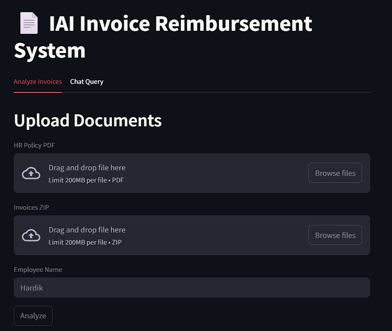
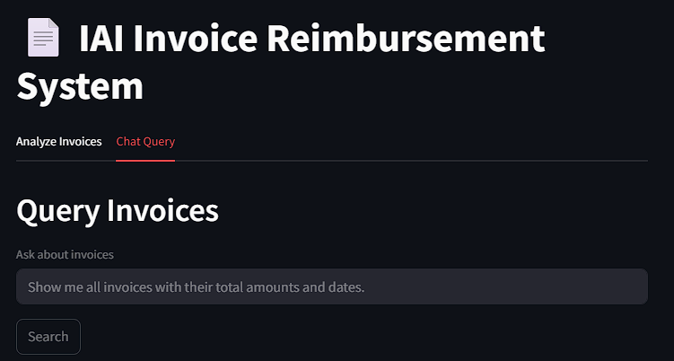

# Invoice Reimbursement System


## Project Overview

The Invoice Reimbursement System is an AI-powered application that automates the analysis of employee expense invoices against company reimbursement policies. Key capabilities include:

- Automated invoice analysis using LLMs (Gemini 1.5 Flash)
- Policy compliance checking with detailed explanations
- Multi-invoice batch processing via ZIP files
- Vector database storage for historical analyses
- Natural language querying of past reimbursements
- Streamlit web interface and FastAPI backend

## Screenshots

### Invoice Analysis Interface
  
*Upload policy PDF and invoices ZIP for automated analysis*

### Chat Query Interface
  
*Natural language querying of past reimbursements*

## Example Files

### Sample Policy Document
[`test_policy.pdf`](examples/test_policy.pdf) contains:
```text
Company Reimbursement Policy:
- Food: ₹200/meal max (no alcohol)
- Travel: ₹2000/trip max
- Cabs: ₹150/day for office commutes
```

### Sample Invoice
[`Meal_Invoice_1.pdf`](examples/Meal_Invoice_1.pdf) shows:
```text
Restaurant Bill:
- 2 Biriyani: ₹400
- 2 Whisky: ₹300 (non-reimbursable)
Total: ₹770
```

## Installation Instructions

### Prerequisites
- Python 3.12+
- Google Gemini API key (set as `GEMINI_API_KEY` in `.env`)
- [Poetry](https://python-poetry.org/) (recommended) or pip

### Setup
1. Clone the repository:
   ```bash
   git clone https://github.com/AnubhavDubey23/IAI_solution.git
   cd IAI_solution
   ```

2. Install dependencies:
   ```bash
   poetry install  # or pip install -r requirements.txt
   ```

3. Create a `.env` file:
   ```env
   GEMINI_API_KEY=your_api_key_here
   ```

4. Initialize the vector database:
   ```bash
   python -c "from services.vector_store import VectorStore; VectorStore()"
   ```

### Running the Application
- **API Mode**:
  ```bash
   uvicorn main:app --reload
   ```
   Access docs at `http://localhost:8000/docs`

- **Web Interface**:
  ```bash
   streamlet run app.py
   ```

## Usage Guide

### API Endpoints

1. **Analyze Invoices** (`POST /analyze-invoice`):
   - Uploads:
     - `policy_pdf`: Company reimbursement policy PDF
     - `invoices_zip`: ZIP containing invoice PDFs
   - Form parameter:
     - `employee_name`: Name of employee submitting invoices
   - Returns: Analysis results for each invoice

2. **Chat Query** (`POST /chat`):
   - Body:
     ```json
     {
       "query": "Find invoices over ₹1000",
       "history": [],
       "filters": {"status": "Partially"}
     }
     ```
   - Returns: Natural language response with relevant invoices

### Web Interface
1. **Analyze Tab**:
   - Upload HR policy PDF
   - Upload ZIP of invoices
   - Enter employee name
   - View analysis results

2. **Chat Tab**:
   - Enter natural language queries
   - View matching invoices with metadata

## Technical Details

### Architecture
```
Frontend (Streamlit) ↔ FastAPI ↔ LLM Service ↔ Vector DB
```

### Key Components
- **LLM Service**: Uses Gemini 1.5 Flash for:
  - Invoice analysis against policy
  - Natural language query responses
- **Vector Store**: ChromaDB with:
  - SentenceTransformer embeddings (`all-MiniLM-L6-v2`)
  - Metadata filtering capabilities
- **PDF Processing**: PyPDF2 for text extraction with:
  - Amount detection
  - Batch ZIP processing

### Libraries
- Core: FastAPI, Streamlit, LangChain
- PDF: PyPDF2, zipfile
- Vector DB: chromadb, sentence-transformers
- LLM: google-generativeai

## Prompt Design

### Invoice Analysis Prompt
```text
You are an expert invoice reimbursement analyst...
[Policy guidelines with specific amounts]
[Required analysis steps]
[Strict response format enforcement]
```

### Chatbot Prompt
```text
Respond in clear markdown format with:
- **Answer**: Direct response
- **Sources**: Invoice excerpts
- **Confidence**: High/Medium/Low
```

## Challenges & Solutions

1. **PDF Text Extraction**:
   - Challenge: Inconsistent invoice formats
   - Solution: Focused amount regex + fallback analysis

2. **Response Parsing**:
   - Challenge: LLM output variability
   - Solution: Strict format enforcement + robust regex parsing

3. **Vector Search**:
   - Challenge: Mixed metadata + semantic search
   - Solution: Post-filtering for numeric comparisons

## Contribution Guidelines

We welcome contributions! Please follow these steps:

1. Fork the repository
2. Create a feature branch (`git checkout -b feature/your-feature`)
3. Commit your changes (`git commit -m 'Add some feature'`)
4. Push to the branch (`git push origin feature/your-feature`)
5. Open a Pull Request

Please ensure:
- Code follows PEP 8 style guide
- New features include tests
- Documentation is updated

